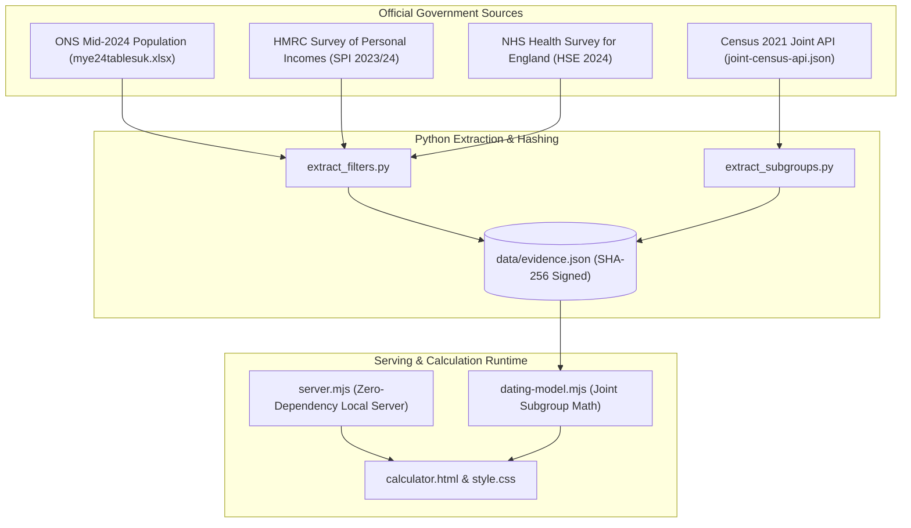

<div align="center">

# 🇬🇧 UK DATING STATISTIC CALCULATOR & EVIDENCE EXPLORER
### *Empirical UK Dating Pool Modeling & Demographic Probability Engine*

[](https://nodejs.org/)
[](https://python.org/)
[](https://www.ons.gov.uk/)
[](https://www.gov.uk/government/organisations/hm-revenue-customs)
[](v3/)
[](LICENSE)

<p align="center">
  <b>A rigorous demographic intelligence tool that models realistic dating pool sizes using official UK government data from the Office for National Statistics (ONS), NHS Health Survey for England, and HMRC.</b>
</p>

[Visual Tour](#-interface-showcase) • [Key Capabilities](#-dual-engine-architecture) • [Data Provenance](#-official-data-provenance--methodology) • [Quick Start](#-quick-start) • [Author](#-author)

---

</div>

## 📸 Interface Showcase

<div align="center">
  
</div>

<p align="center"><i>The V3 Requirements Calculator: Parametric modeling of adult demographics across UK geographies, age bands, qualification levels, income brackets, and marital status.</i></p>

<div align="center">
  
  
</div>

<p align="center"><i>Left: Demographic Evidence Explorer with ONS cell references. Right: Primary source workbook validation and SHA-256 fingerprint verification.</i></p>

---

## 🏛️ Executive Overview

The **UK Dating Statistic Calculator** eliminates dating market myths through cold, empirical demographic realities. Instead of relying on unverified internet dating tropes or commercial dating app algorithms, this platform constructs realistic pool probabilities derived directly from primary UK government statistical workbooks.

### Core Architecture Highlights
- **V3 Zero-Dependency Engine**: Built purely with native Vanilla ES Modules, semantic HTML5, and CSS3. Requires zero npm packages, zero external CDNs, and zero cloud API credentials.
- **Joint Subgroup Probability**: Uses cross-tabulated Census 2021 microdata (`country × sex × age-band × qualification × ethnic-group`) to avoid naive independence assumptions.
- **Dual-Engine Suite**:
  1. **V3 Modern Web Atelier (`v3/`)**: Ultra-fast, zero-overhead client-side requirements calculator and demographic evidence explorer.
  2. **Streamlit Analytical Dashboard (`app.py`)**: Legacy comprehensive Python data exploration suite with detailed marriage and divorce analytics.

---

## ✨ Dual-Engine Architecture

| Feature Dimension | V3 Modern Edition (`v3/`) | Legacy Streamlit Edition (`app.py`) |
|---|---|---|
| **Primary Focus** | Client-side requirements calculator & demographic explorer | Python-based interactive statistical visualizer |
| **Dependencies** | Zero runtime dependencies (Pure Node / Native JS) | Python 3, Streamlit, Pandas, Plotly |
| **Data Verification** | Pinned ONS/HMRC workbooks with SHA-256 hashes | Official UK Government API & survey tables |
| **Subgroup Math** | Exact joint probability conditioning: `P(ethnicity \| qual, country, sex, age)` | Multiplicative demographic filters with age weighting |
| **Data Integrity** | Cell-level citations, confidence intervals, no invented values | Extensive marriage, divorce, and regional breakdown tabs |

---

## 📊 Filter Dimensions & Statistical Bounds

The calculator enables precise parametric filtering across verified UK adult distributions:

- **Geography**: United Kingdom, England, Wales, Scotland, Northern Ireland, and specific English regions.
- **Age Span**: Granular single-year and multi-year cohorts from 18 to 65+ (based on ONS mid-2024 population estimates).
- **Height (Gaussian Model)**: Centimeter and imperial (feet/inches) inputs mapped against NHS Health Survey for England mean/SD curves.
- **Income (HMRC SPI)**: True UK income distribution including £100k+, £250k+, and £1M+ earners incorporating self-employed, dividend, and property income.
- **Education**: Regulated Qualifications Framework (RQF) Levels: GCSE, A-Level, Degree (Level 4+), and Postgraduate.
- **Relationship Status**: ONS 2025 living arrangements (Single never-married, Cohabiting, Married, Divorced/Separated, Widowed).
- **Sexual Orientation**: ONS 2024 Table 6b age-and-sex percentages with explicit confidence bounds.

---

## 🏗️ System Architecture



---

## 📁 Repository Structure

```text
UK dating statistic calculator/
├── v3/                                 # [Recommended] Modern zero-dependency edition
│   ├── calculator.html                 # Requirements calculator interface
│   ├── index.html                      # Secondary demographic evidence explorer
│   ├── app.mjs                         # Application orchestration & tab controls
│   ├── dating-model.mjs                # Joint demographic probability math engine
│   ├── dating.mjs                      # Dynamic UI rendering & scenario comparisons
│   ├── server.mjs                      # Lightweight local Node.js server
│   ├── style.css & dating.css          # Modern dark/light luxury CSS design system
│   ├── data/                           # Extracted demographic JSON tables
│   ├── sources/                        # Retained original ONS/HMRC Excel workbooks
│   ├── scripts/                        # Reproducible Python extractors
│   ├── tests/                          # Node test suite & browser QA scripts
│   ├── dating-desktop-qa.png           # High-resolution calculator screenshot
│   ├── desktop-qa.png                  # Evidence explorer screenshot
│   ├── sources-qa.png                  # Data provenance proof screenshot
│   └── AUDIT.md                        # Comprehensive methodological audit
├── app.py                              # Legacy Streamlit entry point
├── calculations.py                     # Legacy demographic calculation math
├── data.py                             # Legacy data tables & static arrays
├── ui_marriage_stats_content.py        # UK marriage & divorce analytics
├── requirements.txt                    # Streamlit Python dependencies
└── README.md                           # Master repository documentation
```

---

## 🚀 Quick Start

### Launching the Modern V3 Edition (Recommended)

Requires **Node.js 20+**:

```powershell
# Navigate to v3
cd "v3"

# Start server on an OS-assigned random port
npm start
```

*The server will print its active localhost address (e.g. `http://127.0.0.1:49215`). Open this URL in any modern browser.*

To execute automated unit and integration tests:
```powershell
npm test
```

### Launching the Legacy Streamlit App

Requires **Python 3.10+**:

```bash
# Install Python dependencies
pip install -r requirements.txt

# Launch Streamlit server
streamlit run app.py
```

---

## 📜 Official Data Provenance & Methodology

Every metric displayed by this application traces back to an official government publication:
- **ONS Population Estimates**: Pinpoint mid-2024 UK counts released 26 September 2025.
- **ONS Living Arrangements**: Table 1–6 living arrangement and legal marital status releases (July 2026).
- **HMRC Survey of Personal Incomes**: 2023/24 percentiles covering both PAYE employee earnings and self-assessment entrepreneurs.
- **NHS Health Survey for England (HSE)**: Physical biometric data (height distributions and BMI classifications).

---

## 👤 Author & Brand Profile

**Otis Powell** ([@passportpowell](https://github.com/passportpowell))  
- 🌐 GitHub: [github.com/passportpowell](https://github.com/passportpowell)
- 📺 YouTube: [@PassportPowell](https://www.youtube.com/@PassportPowell)
- 💼 LinkedIn: [in/otispowell](https://www.linkedin.com/in/otispowell/)
- 𝕏 Twitter: [@PassportPowell](https://x.com/PassportPowell)
